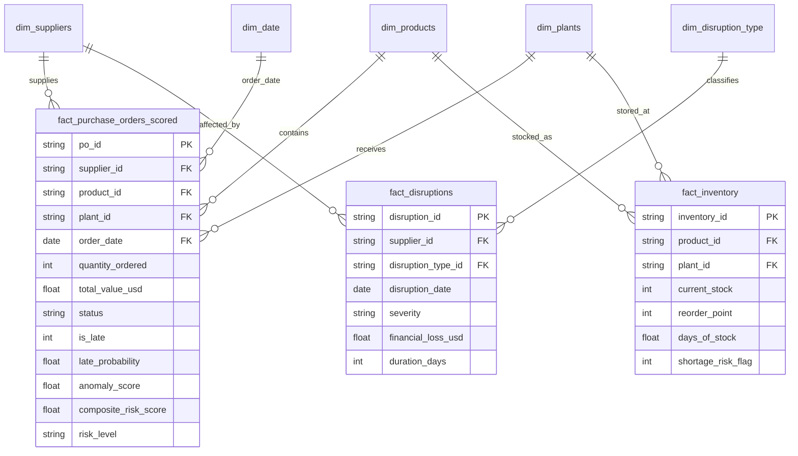
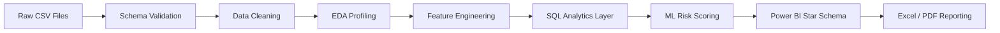

<div align="center">

# 🚢 Supply Chain Risk Analytics

### End-to-End Disruption, Inventory & Late-Delivery Risk Scoring Platform

<p>
  
  
  
  
</p>

<p>
  <b>3,000 purchase orders</b> · <b>120 suppliers</b> · <b>200 disruption events</b> · <b>$478.9M disruption loss analyzed</b>
</p>

</div>

---

## 📌 Project Overview

**Supply Chain Risk Analytics** is a full-stack analytics project that identifies late-delivery risk, disruption exposure, supplier risk, and inventory bottlenecks across a simulated enterprise supply-chain network.

The project combines **SQL analytics**, **Python-based EDA**, **machine learning risk scoring**, **Power BI dashboarding**, and **Excel reporting** to convert raw supply-chain data into an executive-ready decision-support system.

The pipeline analyzes purchase orders, suppliers, inventory, plant operations, disruption events, and risk indicators to answer one core business question:

> **Which purchase orders, suppliers, plants, and inventory items require immediate action to reduce late deliveries, financial loss, and operational disruption?**

<p align="center">
  
  
</p>

### Executive KPIs

| Metric | Value |
|---|---:|
| Purchase orders analyzed | **3,000** |
| Suppliers monitored | **120** |
| Disruption events analyzed | **200** |
| Late deliveries | **852** |
| Late-delivery rate | **28.4%** |
| Total disruption loss | **$478,893,166** |
| High / Critical risk purchase orders | **640** |
| Inventory SKU lines analyzed | **160** |
| SKU lines below reorder point | **17** |
| Shortage-risk SKU lines | **6** |
| High/Critical understocked items | **9** |
| Pipeline runtime | **4.6 seconds** |

---

## 💼 Business Impact

This project delivers a practical analytics layer for procurement, operations, supply-chain planning, and executive teams.

### Key Business Outcomes

- **Detected 852 late deliveries**, representing a **28.4% late-delivery rate** across all purchase orders.
- Quantified **$478.9M** in disruption-driven financial loss.
- Flagged **640 high/critical purchase orders** for proactive intervention.
- Identified **17 SKU lines below reorder point**, including **9 high/critical items**.
- Built a cost-based intervention framework that reduces expected late-risk cost from **$10.22M** to **$979.8K**, a **90.4% cost reduction** versus ignoring late risk.
- Defined actionable alert tiers for procurement teams: **Critical, High, Medium, Low**.

<p align="center">
  
  
</p>

### KPI Alert Tiers

| Risk Tier | Rule | Business Action |
|---|---|---|
| 🔴 Critical | Risk score ≥ 75 | Escalate to procurement lead and activate backup supplier |
| 🟠 High | Risk score 50–75 | Expedite review and contact supplier within 24h SLA |
| 🟤 Medium | Risk score 25–50 | Monitor weekly and review supplier status |
| 🟢 Low | Risk score < 25 | Standard purchase-order processing |

---

## 🧱 Project Structure

```text
SUPPLY-CHAIN-RISK-ANALYTICS/
│
├── data/
│   ├── raw/                         # Source CSV files
│   ├── processed/                   # Cleaned / joined datasets
│   └── exports/                     # Final scored outputs and report extracts
│
├── notebooks/
│   ├── 01_eda_cleaning.ipynb        # Data quality, EDA and profiling
│   ├── 02_feature_engineering.ipynb # Feature creation and risk variables
│   └── 03_modeling_scoring.ipynb    # ML modeling, scoring and threshold tuning
│
├── sql/
│   ├── create_tables.sql            # Schema creation
│   ├── analysis_queries.sql         # Business analytics SQL queries
│   └── sql_exports/                 # Query outputs for reporting
│
├── powerbi/
│   ├── DATA_MODEL.md                # Star-schema relationships
│   ├── MEASURES.dax                 # Production DAX measures
│   └── star_schema_exports/         # Power BI-ready fact and dimension tables
│
├── reports/
│   ├── Supply_Chain_Risk_Report.pdf # Executive report
│   └── Excel_Report.xlsx            # Excel summary pack
│
├── assets/
│   └── images/                      # Graphs used in README and reporting
│
├── docs/
│   └── features.json                # Final ML feature list
│
├── requirements.txt
└── README.md
```

<p align="center">
  
</p>

---

## 🗄️ Database Schema — Star Schema

The analytics model is designed as a **star schema**, optimized for Power BI reporting, SQL querying, and KPI calculation.



### Why Star Schema?

- Faster Power BI slicing by supplier, plant, product, date, risk tier, and disruption type.
- Clear separation between **facts** and **dimensions**.
- Reusable DAX measures for delivery, risk, supplier, disruption, and inventory KPIs.
- Easy integration with SQL exports and Excel summary tables.

---

## 📋 Tables at a Glance

| Table | Type | Purpose | Example Fields |
|---|---|---|---|
| `fact_purchase_orders_scored` | Fact | Main purchase-order table with model scores and risk levels | PO ID, supplier, product, plant, value, late probability, risk score |
| `fact_disruptions` | Fact | Disruption event tracking and financial loss analysis | Disruption type, severity, duration, loss |
| `fact_inventory` | Fact | Inventory health and reorder-risk monitoring | Current stock, reorder point, days of stock, shortage flag |
| `dim_suppliers` | Dimension | Supplier attributes and risk indicators | Supplier category, tier, risk band, quality, OTD |
| `dim_products` | Dimension | Product and SKU information | Category, criticality, BOM components, unit cost |
| `dim_plants` | Dimension | Plant-level supply-chain locations | Plant, region, country |
| `dim_date` | Dimension | Date hierarchy for trend analysis | Year, quarter, month, week |
| `dim_disruption_type` | Dimension | Disruption classification | Cyber attack, logistics delay, port strike, pandemic, etc. |

<p align="center">
  
  
</p>

---

## 🧹 Exploratory Data Analysis & Data Cleaning

The EDA and cleaning phase prepares the raw operational data for analytics, modeling, and dashboarding.

### Data Cleaning Activities

- Standardized column names to clean `snake_case` format.
- Validated purchase-order status values and delivery outcome labels.
- Checked missing values, duplicate keys, and invalid dates.
- Converted financial columns into numeric USD fields.
- Created late-delivery flag using delivery status and delay signals.
- Removed post-event leakage fields from model training where required.
- Joined purchase orders with supplier, product, disruption, plant, and inventory tables.
- Created business-friendly output tables for SQL, Excel, and Power BI.

<p align="center">
  
  
</p>

### Key EDA Findings

- **Mechanical Parts** suppliers show the highest late-delivery rate at **32%**.
- Overall late-delivery volume remains consistently high from **2021–2024**.
- **Logistics Delay** is the largest loss driver at approximately **$70M**.
- Supplier risk is concentrated in **Medium** and **High** risk bands.
- `delay_days` has a strong relationship with `is_late`, while real-world predictive features show weaker signal in this synthetic dataset.

---

## 🔁 EDA Pipeline



### Pipeline Stages

| Stage | Output |
|---|---|
| Raw ingestion | Source tables loaded into Pandas and DuckDB |
| Validation | Missing values, duplicates, date checks, categorical checks |
| Cleaning | Standardized data types and analytics-ready columns |
| Feature engineering | Late flags, supplier features, inventory features, disruption features |
| Modeling | Isolation Forest anomaly score and Random Forest late probability |
| Scoring | Composite risk score and risk-level assignment |
| Reporting | Power BI star schema, Excel extracts, PDF executive report |

<p align="center">
  
  
</p>

---

## 🧠 Machine Learning & Risk Scoring

The project uses two complementary models:

1. **Isolation Forest** — detects unusual purchase orders and supplier-risk anomalies.
2. **Random Forest Classifier** — estimates late-delivery probability.

The final **composite risk score** blends model outputs:

```text
Composite Risk Score = 70% × Late Delivery Probability + 30% × Normalized Anomaly Score
```

### Model Notes

In this synthetic dataset, late/on-time labels are only weakly explained by pre-delivery features once post-hoc leakage fields are excluded. Therefore, model lift is modest, but the architecture is production-ready and transferable to real operational data.

| Model / Metric | Result |
|---|---:|
| Random Forest ROC-AUC | **0.5254** |
| Isolation Forest ROC-AUC | **0.5205** |
| Random Forest Average Precision | **0.313** |
| Cost-optimal intervention threshold | **0.23** |
| Recall at selected threshold | **0.9695** |
| Expected cost at selected threshold | **$979,800** |

<p align="center">
  
  
</p>

<p align="center">
  
  
</p>

<p align="center">
  
</p>

---

## 🧾 SQL Analytics

A SQL analytics layer was built using **DuckDB**, enabling reproducible business queries over cleaned, joined, and modeled supply-chain tables.

### SQL Query Themes

| Query Area | Business Purpose |
|---|---|
| Shipment delay by supplier | Identify suppliers driving the most delayed POs |
| Supplier risk overview | Rank suppliers by risk band, delivery performance, and incident exposure |
| Inventory bottlenecks | Find SKUs below reorder point and high-criticality shortages |
| Disruption impact | Quantify loss by disruption type, severity, and supplier category |
| Plant inventory health | Identify plants with concentrated shortage risk |

### Example SQL Query

```sql
SELECT
    s.supplier_category,
    COUNT(*) AS purchase_orders,
    SUM(CASE WHEN po.is_late = 1 THEN 1 ELSE 0 END) AS late_orders,
    ROUND(100.0 * AVG(po.is_late), 2) AS late_rate_pct,
    ROUND(SUM(po.total_value_usd), 2) AS total_order_value
FROM fact_purchase_orders_scored po
JOIN dim_suppliers s
    ON po.supplier_id = s.supplier_id
GROUP BY s.supplier_category
ORDER BY late_rate_pct DESC;
```

<p align="center">
  
  
</p>

---

## 📊 Power BI Dashboard

The project includes a Power BI-ready star schema and DAX measure layer for executive monitoring.

### Recommended Dashboard Pages

| Page | Purpose | Suggested Visuals |
|---|---|---|
| Executive Overview | High-level KPI summary | KPI cards, risk distribution, late-rate trend |
| Supplier Risk | Supplier segmentation and watchlist | Supplier risk band, late rate by category, ranked supplier table |
| Disruption Impact | Loss and severity monitoring | Loss by type, disruption severity stack, event timeline |
| Inventory Health | Bottlenecks and reorder risk | Days of stock, stock vs reorder point, plant shortage bars |
| ML Risk Scoring | Model performance and risk thresholding | ROC, PR curve, confusion matrix, feature importance, cost curve |

### Suggested DAX Measures

```DAX
Total Purchase Orders = COUNTROWS(fact_purchase_orders_scored)

Late Orders =
CALCULATE(
    COUNTROWS(fact_purchase_orders_scored),
    fact_purchase_orders_scored[is_late] = 1
)

Late Delivery Rate = DIVIDE([Late Orders], [Total Purchase Orders])

Total Disruption Loss = SUM(fact_disruptions[financial_loss_usd])

High Critical Risk POs =
CALCULATE(
    COUNTROWS(fact_purchase_orders_scored),
    fact_purchase_orders_scored[risk_level] IN {"High", "Critical"}
)

Shortage Risk SKUs =
CALCULATE(
    COUNTROWS(fact_inventory),
    fact_inventory[shortage_risk_flag] = 1
)
```

<p align="center">
  
  
</p>

---

## 📑 Reporting & Excel Integration

This project is designed for both technical analysis and business reporting.

### Reporting Deliverables

| Deliverable | Description |
|---|---|
| PDF Executive Report | Narrative report covering EDA, model performance, scoring, cost optimization, SQL findings, and Power BI deliverables |
| Excel Report | Business-friendly tables for supplier watchlists, inventory bottlenecks, risk tiers, and disruption summaries |
| Power BI Dataset | Star-schema CSV exports and DAX measures for interactive dashboards |
| SQL Exports | Query result CSVs for repeatable analytics and auditability |

### Excel Use Cases

- Procurement action tracker for high/critical purchase orders.
- Supplier performance review pack.
- Plant inventory shortage review.
- Disruption-loss summary by type and severity.
- Weekly risk-monitoring report for operations leaders.

<p align="center">
  
  
</p>

> 📄 Full report: [`docs/Supply_Chain_Risk_Report.pdf`](docs/Supply_Chain_Risk_Report.pdf)

---

## 🚀 Getting Started

Follow these steps to reproduce the project locally.

### 1. Clone the Repository

```bash
git clone https://github.com/rohit-bhowmick2002/SUPPLY-CHAIN-RISK-ANALYTICS.git
cd SUPPLY-CHAIN-RISK-ANALYTICS
```

### 2. Create a Virtual Environment

```bash
python -m venv .venv
source .venv/bin/activate      # macOS/Linux
# .venv\Scripts\activate       # Windows
```

### 3. Install Dependencies

```bash
pip install -r requirements.txt
```

### 4. Run the Pipeline

```bash
python src/run_pipeline.py
```

### 5. Run SQL Analysis

```bash
duckdb supply_chain.duckdb < sql/analysis_queries.sql
```

### 6. Open Power BI

1. Open Power BI Desktop.
2. Import CSV exports from `powerbi/star_schema_exports/`.
3. Recreate relationships from `powerbi/DATA_MODEL.md`.
4. Paste measures from `powerbi/MEASURES.dax`.
5. Build dashboard pages using the suggested layout above.

---

## 🧰 Tech Stack

<div align="center">

| Category | Tools |
|---|---|
| Programming | Python |
| Data Analysis | Pandas, NumPy |
| Machine Learning | Scikit-learn, Random Forest, Isolation Forest |
| SQL Engine | DuckDB SQL |
| BI & Dashboarding | Power BI, DAX, Power Query |
| Reporting | Excel, PDF reporting |
| Visualization | Matplotlib, Seaborn |
| Version Control | Git, GitHub |

</div>

<p align="center">
  
  
  
  
  
  
  
</p>

---

## ❓ Key Business Questions Answered

| Business Question | Project Answer |
|---|---|
| What percentage of purchase orders are late? | **28.4%** of purchase orders are late. |
| Which supplier categories have the highest late rate? | **Mechanical Parts** has the highest late rate at **32%**. |
| Which disruption types create the largest financial losses? | **Logistics Delay** is the largest financial-loss driver. |
| How many suppliers are in each risk band? | **48 low**, **50 medium**, and **22 high-risk** suppliers. |
| How many purchase orders require intervention? | **640 high/critical POs** are flagged for action. |
| Which inventory items are below reorder point? | **17 SKU lines** are below reorder point. |
| Are critical inventory items understocked? | **9 high/critical items** are understocked. |
| Which plants have inventory bottlenecks? | Warsaw, Monterrey, Shanghai, and Toronto show visible bottleneck concentration. |
| What threshold minimizes intervention cost? | A threshold of **0.23** minimizes expected cost to **$979,800**. |
| Can the model be used directly in operations? | Yes — the scoring, alert tiers, SQL outputs, and Power BI model are production-style and operationally ready. |

<p align="center">
  
  
</p>

---

## ✅ Additional Insights

### Inventory Risk

- Median stock coverage is approximately **32 days**.
- Lowest coverage is approximately **1.8 days of stock**.
- Shortage-risk flags are concentrated in a small number of plants, enabling targeted intervention.

### Disruption Risk

- Logistics delays, port strikes, and natural disasters are major loss contributors.
- Disruption severity should be monitored alongside supplier and inventory risk.
- Financial exposure is not evenly distributed; specific event types dominate loss.

### Modeling Insight

- The current synthetic dataset has limited signal for late-delivery prediction.
- The value of the project is the complete analytics architecture: repeatable pipeline, risk scoring, cost thresholding, and business reporting.
- On real-world operational data, supplier lead-time history, disruption signals, quality scores, and inventory status can significantly improve predictive power.

---

## 📌 Final Recommendations

1. Prioritize **Critical** and **High** risk purchase orders for immediate procurement review.
2. Build a recurring supplier performance review for high-risk suppliers.
3. Monitor logistics-delay exposure because it contributes the highest financial loss.
4. Use the **0.23 intervention threshold** for cost-sensitive alerting.
5. Focus inventory action on SKU lines below reorder point, especially high/critical items.
6. Refresh Power BI dashboards weekly using the scored purchase-order export.

<p align="center">
  
  
</p>

---

## 👤 Author

<div align="center">

### Rohit Bhowmick

**Data Analyst | Microsoft Certified PL-300 | SQL · Python · Power BI · DAX**

<p>
  <a href="mailto:rohitbhowmick817@gmail.com"></a>
  <a href="https://www.linkedin.com/in/rohit-bhowmick"></a>
  <a href="https://github.com/rohit-bhowmick2002"></a>
</p>

</div>

---

<div align="center">

### ⭐ If this project helped you, consider starring the repository.

<b>Built to turn supply-chain risk signals into faster, smarter operational decisions.</b>

</div>
